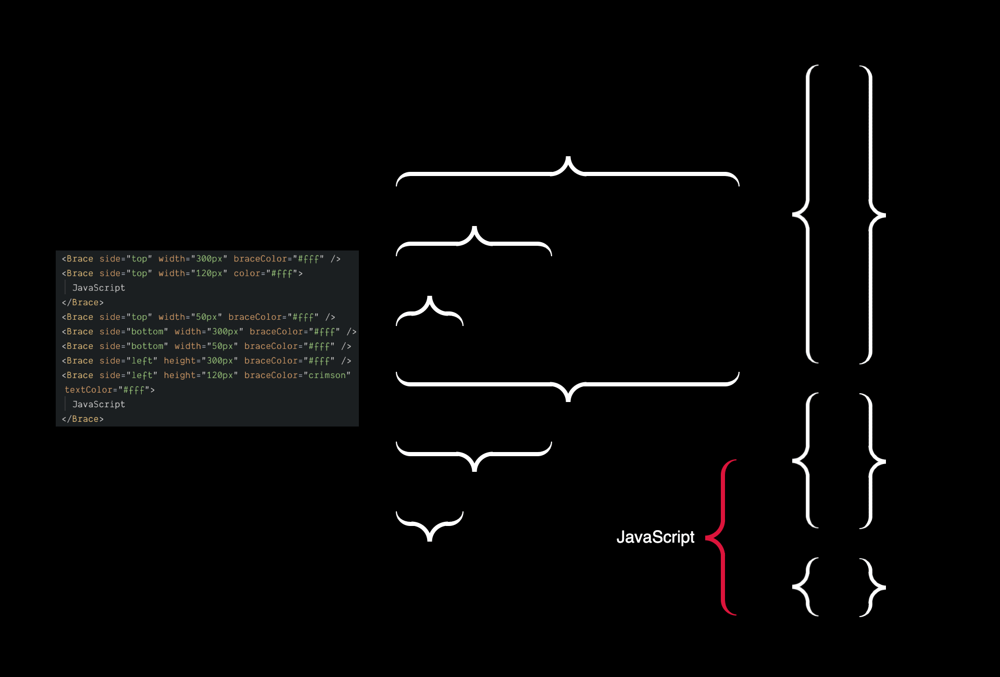

# react-sc-braces

> Curly braces to indicate elements in diagrams (built in React and styled-components)



For vanilla HTML + CSS, check out the [Codepen](https://codepen.io/karlhorky/pen/vwmqqv).

## Install

This component is intended for use with React and styled-components. If you're using those libraries already, just copy and paste the component file [`Brace.js`](./Brace.js) into your codebase. This hasn't been published as a package yet, because publishing CSS packages is not great with the current state of tooling in 2019.

## [Demo](https://codesandbox.io/s/reactscbraces-gpjv3)

## Examples

```jsx
<Brace side="left" height="120px" braceColor="#fff" />

{/* Default to #000 braceColor */}
<Brace side="top" width="300px" />

{/* Default to top side and auto width */}
<Brace />
```

## Props

| prop         | values                                          | default |
| ------------ | ----------------------------------------------- | ------- |
| `side`       | `top`, `bottom`, `left`, or `right`             | `top`   |
| `color`      | CSS color for both the curly brace and the text | `#000`  |
| `braceColor` | CSS color for the curly brace                   | `#000`  |
| `textColor`  | CSS color for the text                          | `#000`  |
| `width`      | width of the `top` and `bottom` side braces     | auto    |
| `height`     | height of the `left` and `right` side braces    | auto    |

## Credit

Heavily inspired by [Lauren Herda](https://github.com/lrenhrda)'s [Codepen](https://codepen.io/lrenhrda/pen/hkLIe).
